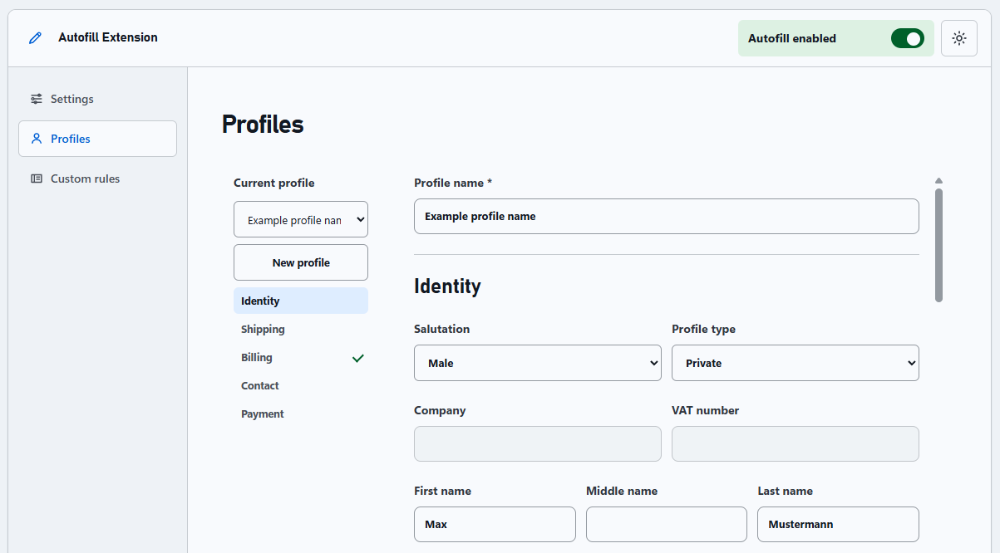

# Autofill Extension

This Chrome extension fills web forms automatically with previously created profiles for everyday use and testing.



## Installation

1. Clone or download this repository to your local machine:
```bash
git clone https://github.com/mkoebsch/chrome-autofill-extension.git
```

2. Open Chrome and navigate to chrome://extensions/.

3. Enable Developer mode in the top-right corner.

4. Click Load unpacked and select the directory containing the extension files.

5. The extension will appear in your list of extensions.

## Usage

1. The onboarding opens after installation. You can reopen the settings page from the extension icon at any time.

2. Create your first profile.

3. Choose whether Autofill runs from the injected button, on selected websites or automatically.

4. Turn on **Autofill enabled** in the header.